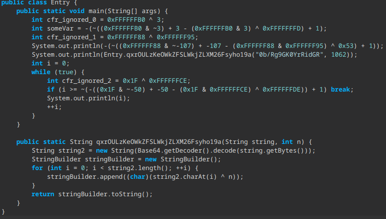

# Ambien

# Features
|   Feature   | Implemented |
| ----------- | ----------- |
| String encryption       | partial |
| Flow obfuscation        | partial |
| Invoke dynamics         | 🚫 |
| Crashers                | ✅ |
| Miscellaneous ZIP stuff | ✅ |
###### As of 1.2.0-beta release

# Usage
Download the latest jar [here](https://github.com/iiiiiiiris/Ambien/releases/latest)

Run the jar with no args (it will generate a default config for you to edit)

Run the Ambien jar with the path to your settings file as the first & only argument

**Note to developers: to see debug output, add `-Dorg.slf4j.simpleLogger.defaultLogLevel=DEBUG` to vm options**

# Media

Flow & string obfuscation

Crasher

###### As of  1.2.0-beta release

# Dependencies
###### [Lombok](https://projectlombok.org/)

###### [ASM](https://asm.ow2.io/)

###### [SLF4J](https://www.slf4j.org/)

###### [GSON](https://github.com/google/gson)
