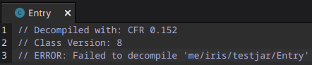
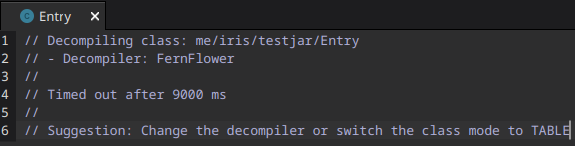
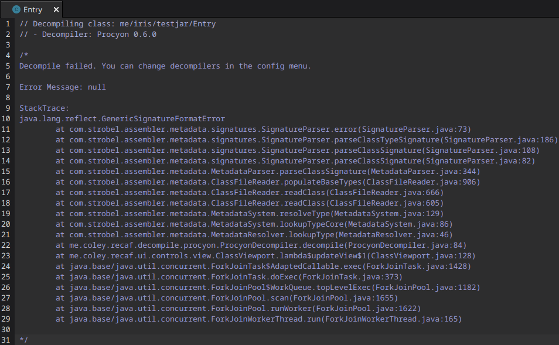

# Ambien

# Features
|   Feature   | Implemented |
| ----------- | ----------- |
| String encryption       | ✅ |
| Number obfuscation      | ✅ |
| Flow obfuscation        | ✅ |
| Reference obfuscation   | ✅ |
| Crashers                | ✅ |
| Miscellaneous ZIP stuff | ✅ |
| GUI                     | 🚫 |

**_As of 1.5.0-beta release, unimplemented features will be added at some point_**

# Usage
* Download the latest jar [**here**](https://github.com/iiiiiiiris/Ambien/releases/latest)
  * The jar ending in `-beta` is the obfuscator itself.
  * The jar ending in `-lib` is an optional library you can use to exclude methods & classes.

**Before using:**
* Ambien MUST be ran with Java 8+
* Ambien should not be used alongside or with other obfuscators.

Run the jar using the `--create-config` argument to create a base config

Then run the Ambien jar using the `-config` argument (including the path to your config)

###### To see all the arguments Ambien offers, you can use the '-help' argument

# Example obfuscation

Example obfuscation of Ambien v1.4.0

## Original

``` java
public static void main(String[] args) {
    AnotherClass.yellow();
    boolean plaaaaaaaay = false;

    for (int i = 0; i < 15; ++i) {
        System.out.printf("%b: %d\n", plaaaaaaaay, i);
        plaaaaaaaay = !plaaaaaaaay;
    }
}
```


Full test jar source code can be found [here](./src/test/java/me/iris/testjar)

## Obfuscated

```java
public static void main(String[] args) throws Throwable {
    AnotherClass.yellow();
    boolean plaaaaaaaay = false ^ true;
    int i = 0;

    while(i < ((16 | -108 | 0) ^ -101)) {
        byte[] var4 = new byte[]{73, 121, 76, 53, 109, 50, 76, 53, 110, 121, 76, 53, 105, 121, 76, 53, 52, 121, 76, 53, 103, 50, 76, 53, 110, 121, 76, 53};
        System.out.printf(A07cQLY3IyaJGAbxxl5(new String(486kCqNqdnWHTRGJKW21xyGHn05SSE8b5CoJlJHw6Y9hUzd3YCj7qmPGN(var4)), QuVrzlq11JpJxR8B1R7CTzqo6w, 13120), plaaaaaaaay, i);
        boolean var10003;
        if (!plaaaaaaaay) {
            var10003 = true;
            if (((31 | -116 | -22) ^ -37) != ((48 | 50 | -128) ^ 55)) {
            }

            boolean var6 = false;
            if (var6) {
            }
        } else {
            var10003 = false;
        }

        plaaaaaaaay = var10003;
        ++i;
        if (((-22 | 34 | -124) ^ -124) != ((48 | -2 | 123) ^ -40)) {
        }

        boolean var5 = false;
        if (var5) {
        }
    }
}
```

Full class decompilation can be seen [here](https://vip.ci/?98c97d3404ec4125#2keA7i4uBXCjVtoQGFP66Vbh2fJXiWMyWc9ZFKevkHRJ)

Transformer settings can be seen [here](https://vip.ci/?8cc3559a08c792dc#Bru8XXGN3JUZutY75wVCLdnf6ySjGgYRiEFSSEuS4xhp)

## Crasher





**As of 1.2.1-beta release**

## Contributing
* Simply clone this repository
* Add `-Dorg.slf4j.simpleLogger.defaultLogLevel=DEBUG` to vm options to see debug output

## Dependencies
[Lombok](https://projectlombok.org/), [ASM](https://asm.ow2.io/), [SLF4J](https://www.slf4j.org/), [GSON](https://github.com/google/gson) & [JCommander](https://github.com/cbeust/jcommander)

## Tools used & information used
[Recaf](https://github.com/Col-E/Recaf), [jd-gui](https://github.com/java-decompiler/jd-gui) & [wikipedia of instructions](https://en.wikipedia.org/wiki/List_of_Java_bytecode_instructions)
